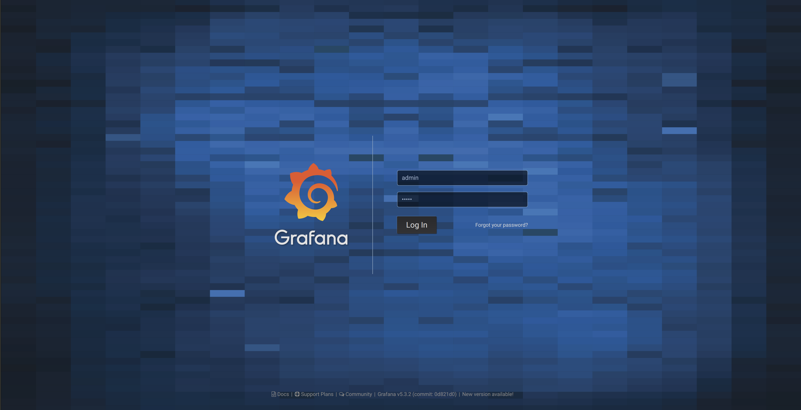
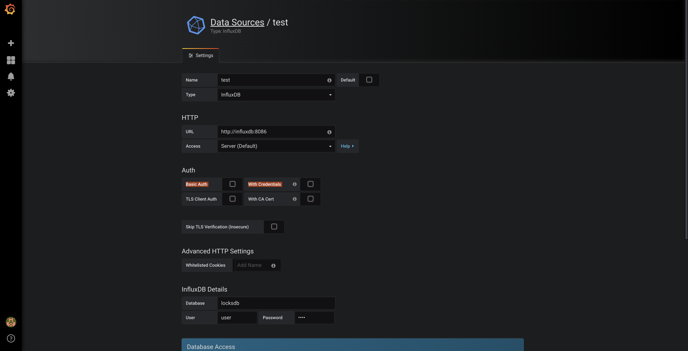
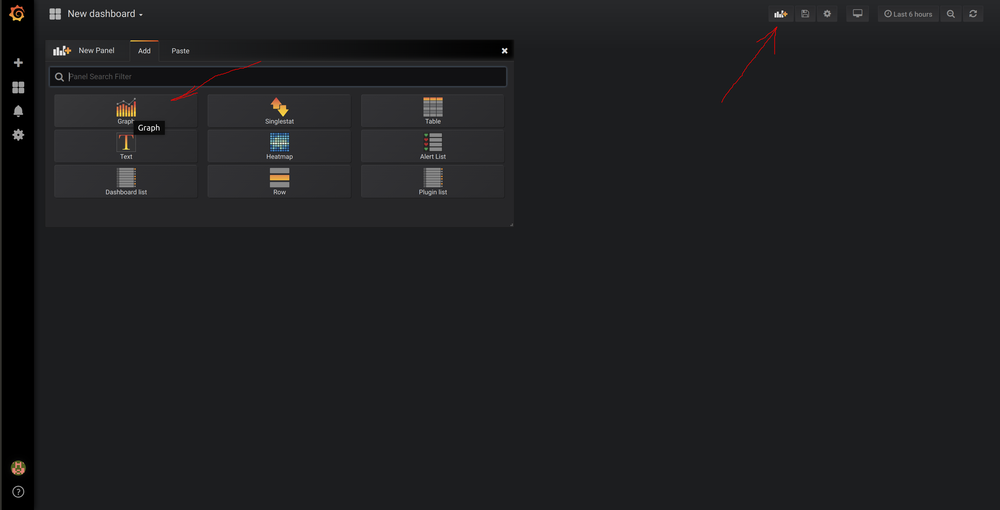
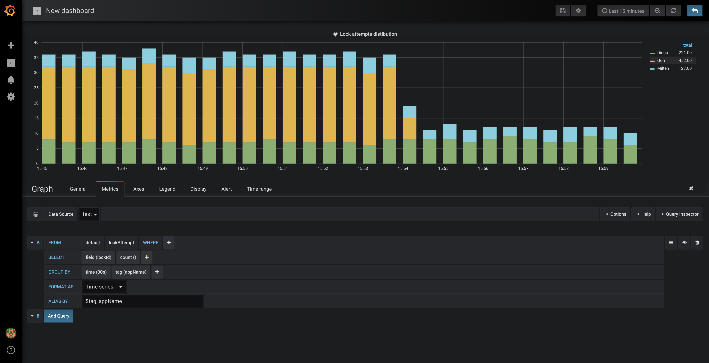
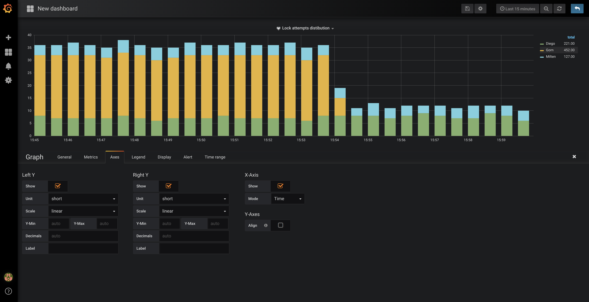
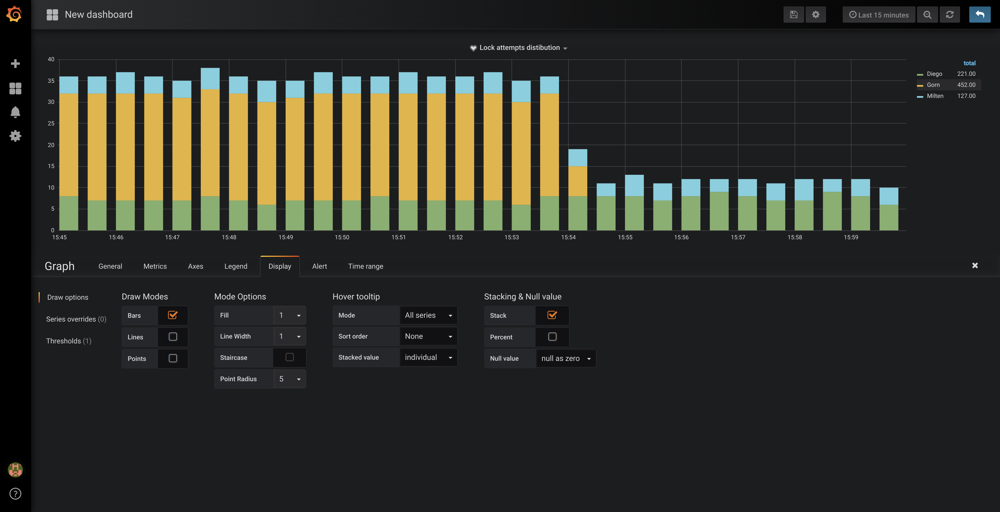

Build jar file locally: \
`mvn clean install` 

Run all applications in local docker: \
`docker-compose -f docker-compose-redis-standalone-grafana.yml up --build`

Log in to Grafana Admin Tool: \
`http://localhost:13000`

Login as admin/admin as it is in default configs for Grafana Docker image:

Configure InfluxDB as Data Source:  

Go to Dashboards and create a new Panel:

Configure metrics:

Configure axes:

Configure legend:

Configure styles for graphic:

And as a result we have a live metrics showing attempts to acquire a lock on redis
per application.
That could be extended to track failed attempts or to discover race conditions (and trigger an alert if needed)